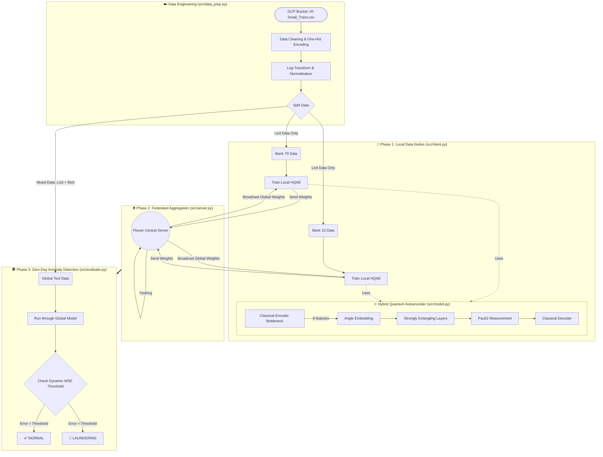

# Quantum Federated AML

This repository implements a Hybrid Quantum-Classical Autoencoder trained via Federated Learning to detect anomalies (money laundering) in the IBM AML dataset.

## Architecture

## Repository Structure

- `setup_env.sh`: Script to initialize the Python virtual environment and install dependencies.
- `requirements.txt`: Python dependencies including `flwr`, `pennylane`, and `torch`.
- `notebooks/EDA.ipynb`: Jupyter notebook containing exploratory data analysis and distribution visualizations of the dataset.
- `src/`
  - `data_prep.py`: Data ingestion and preprocessing. Applies One-Hot Encoding and Log-Transforms, normalizes features for angle embedding, and splits the dataset into unsupervised training nodes (`bank_70_train.csv`, `bank_10_train.csv`) and a mixed testing set (`global_test.csv`).
  - `model.py`: Defines the `HybridAutoencoder` PyTorch module. Features a classical neural network encoder (bottleneck), a PennyLane quantum circuit (`StronglyEntanglingLayers`), and a classical decoder for MSE loss calculation.
  - `server.py`: The Flower (`flwr`) central server orchestrator. Implements the `FedAvg` strategy and saves the aggregated global weights to disk per round.
  - `client.py`: The Flower client node. Loads local bank data, initializes the local quantum model on a simulator, and executes the PyTorch training loop before sending weights back to the server.
  - `evaluate.py`: The final evaluation script. Loads the aggregated weights and tests the global model against `global_test.csv`. Dynamically calculates the optimal MSE threshold to maximize F1-score and outputs Precision, Recall, and the Confusion Matrix.